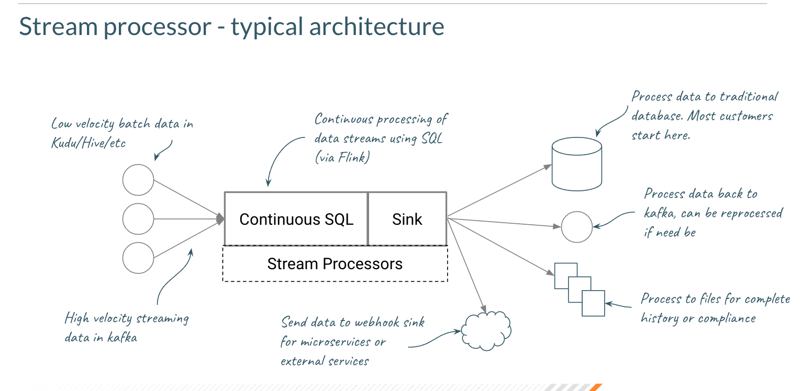

Stream processing is mutating data in a scalable and low latency pipelined fashion from a logical source to a logical sink. It can be used for any number of applications, like fraud detection, manufacturing intelligence, intrusion detection and more. Typically useful where processing events with a low latency requirement is important.

Data is typically event based in nature, and it’s very common to use Apache Kafka as a source (and sometimes sink) for the data. Sinks can also be databases, filesystems, etc. Sources can be defined as databases as well to enrich data via joins.

CSA CE using SQL Stream Builder allows you to build a stream processor using SQL It uses Apache Flink as the core processing engine. There is no need to write java or any complex code.

